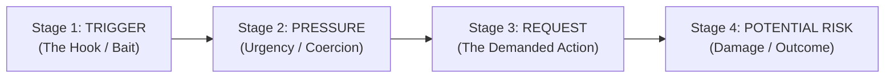

# SafeSpeak AI — Technical Architecture Specification

**Tagline:** *"Think Before You Click."*  
**Problem Statement:** Digital Safety & Cybersecurity

---

## 1. Architectural Overview

SafeSpeak AI is a multi-tier cybersecurity intelligence system designed to deconstruct social-engineering attacks, fraudulent offers, credential-harvesting messages, and deceptive URLs for non-technical users. 

Unlike conventional antivirus scanners that return binary verdicts ("Safe" vs "Malicious"), SafeSpeak AI dissects the **psychological persuasion pipeline** of digital deception.

```
+-------------------------------------------------------------------------+
|                           CLIENT TIER                                   |
|   React 19 + Vite 8 + Tailwind CSS v4 + Lucide Icons + Responsive UI    |
|   [Message Scanner]   [Screenshot OCR Review]   [URL Security Checker]  |
+------------------------------------+------------------------------------+
                                     |
                                     | JSON REST API over HTTPS
                                     v
+------------------------------------+------------------------------------+
|                         APPLICATION GATEWAY                             |
|          Flask 3.1 REST API + CORS + Input Sanitizer + Validators       |
+---------+--------------------------+-------------------------+----------+
          |                          |                         |
          v                          v                         v
+--------------------+     +--------------------+    +--------------------+
|   AI ENGINE TIER   |     |    OCR SERVICE     |    |   URL INSPECTOR    |
| - AIAnalysisService|     | - OCRService       |    | - URLAnalysisServ  |
| - External LLM API |     | - Tesseract check  |    | - TLD / Punycode   |
| - Heuristic Engine |     | - Pillow validator |    | - Homoglyph detect |
| - Risk Story Engine|     | - Preset fallback  |    | - Scheme / IP auth |
+---------+----------+     +---------+----------+    +---------+----------+
          |                          |                         |
          +--------------------------+-------------------------+
                                     |
                                     v
+------------------------------------+------------------------------------+
|                         PERSISTENCE TIER                                |
|          SQLite 3 Database (Indexed scans, telemetry, audit log)         |
+-------------------------------------------------------------------------+
```

---

## 2. Core Subsystems

### 2.1 Frontend Presentation Layer
- **Framework:** React 19 with Vite 8.
- **Styling:** Tailwind CSS v4 using a cybersecurity design system (midnight slate `#070a13`, electric cyan `#06b6d4`, glowing risk badges `#f43f5e`, `#f59e0b`, `#10b981`).
- **Resilience:** Built-in client-side routing, URL hash synchronization, dynamic progress telemetry, and offline-ready API client fallback.
- **Interactive Review:** Users can review and adjust OCR-extracted text prior to submission.

### 2.2 Application Gateway (`backend/app/routes/api.py`)
- Clean RESTful endpoints:
  - `POST /api/analyze/message` — Parses text messages, SMS, emails, job offers.
  - `POST /api/analyze/screenshot/extract` — Image upload & OCR text extraction.
  - `POST /api/analyze/screenshot` — Full evaluation of screenshot text.
  - `POST /api/analyze/url` — Domain, protocol, and structural risk analysis.
  - `GET /api/dashboard/stats` — Real-time telemetry, risk distribution, and counters.
  - `GET /api/history` & `DELETE /api/history` — Audit log retrieval and cleanup.
  - `GET /api/demo/samples` — Realistic predefined scenario presets.
  - `GET /api/complaint/categories` — Standardized cybercrime incident categories & evidence checklists.
  - `POST /api/complaint/generate-draft` — Generates structured, chronological complaint drafts for official portal submission.

### 2.3 Hybrid AI Intelligence & Fallback Architecture
SafeSpeak AI implements an **Abstracted Dual-Engine Strategy**:

1. **Deterministic Heuristic Threat Engine (`RuleBasedAnalysisEngine`):**
   - High-performance, zero-latency local cybersecurity analyzer providing a guaranteed baseline.
   - Evaluates 13 standardized threat signal categories:
     - `URGENCY`: Artificial time pressure, countdowns, immediate action demands.
     - `PAYMENT_REQUEST`: Demands for direct UPI, bank transfer, crypto, or gift cards.
     - `JOB_OR_INTERNSHIP_FEE`: Unethical upfront registration, training, or kit fees.
     - `OTP_REQUEST`: Critical one-time password / 2FA extraction attempts.
     - `CREDENTIAL_REQUEST`: Harvesting passwords, PINs, or confidential logins.
     - `PERSONAL_INFORMATION_REQUEST`: Identity harvesting (Aadhaar, SSN, PAN, card numbers).
     - `REWARD_OR_PRIZE`: Unsolicited lottery, prize, or cash windfall claims.
     - `UNREALISTIC_PROMISE`: Extravagant earnings with minimal effort/work-from-home claims.
     - `ACCOUNT_SUSPENSION`: Coercive claims of account termination, blocks, or deactivation.
     - `THREAT_LANGUAGE`: Intimidation, legal prosecution, arrest, or police threats.
     - `IMPERSONATION`: Brand spoofing (Banks, Netflix, DHL, Google, placement cells).
     - `SUSPICIOUS_URL`: Deceptive domains, unencrypted URLs, IP addresses, or URL shorteners.
     - `CALL_TO_ACTION`: Direct pressure to click unverified links or download attachments.
   - **Category Caps & Anti-Inflation:** Urgency markers are capped at 25 points maximum, grouping duplicate keyword hits into `evidence (+N related indicators)`.
   - **Contextual Brand Filter:** Legitimate mentions of workplace tools (e.g., "Google Meet", "Zoom") do not trigger impersonation alarms unless paired with threats, urgency, or financial demands.
   - **Multilingual Unicode Detection:** Native regex tokenization supporting English and Tamil scam scripts (e.g., பணம் செலுத்துங்கள், உடனடியாக, கடவுச்சொல், வேலை வாய்ப்பு).

2. **External LLM Provider Layer (`AIAnalysisService`):**
   - Integrates with Gemini 2.5 Flash / OpenAI GPT-4o-mini when `AI_API_KEY` is provided.
   - Strictly preserves verified heuristic signals while refining natural language explanations and Risk Story synthesis.
   - Enforces strict JSON-schema output with temperature `0.2`.
   - **Guaranteed Graceful Fallback:** If the external AI key is absent, times out, or fails schema validation, the deterministic heuristic engine provides 100% feature parity with 0 downtime.

### 2.4 Structured Signal Schema
Every detected threat indicator conforms to a standardized schema:

```json
{
  "signal_id": "JOB_OR_INTERNSHIP_FEE",
  "title": "Upfront Internship / Job Fee Demanded",
  "description": "Legitimate employers never demand upfront registration or training fees.",
  "explanation": "Scammers disguise advance-fee fraud as refundable deposits or training charges.",
  "severity": "high",
  "evidence": "registration fee of ₹999 required",
  "quote": "registration fee of ₹999 required",
  "score_contribution": 35
}
```

### 2.5 Risk Score & Confidence Rating Separation
SafeSpeak AI decouples **Threat Severity** from **Detection Certainty**:
- **Risk Score (0–100):** Represents potential danger based on accumulated signal severity points.
  - `LOW RISK` (0–34): Minimal or no threat patterns detected.
  - `MEDIUM RISK` (35–69): Multiple suspicious elements or single moderate threat.
  - `HIGH RISK` (70–100): Severe threat signals (e.g., OTP solicitation, advance fees, coercive suspension threats).
- **Confidence Rating (`High`, `Medium`, `Low`):** Reflects evidentiary certainty:
  - `High`: Substantial input length with multiple corroborating threat signals or clean text with no ambiguities.
  - `Medium`: Clear signals but brief context, or moderate ambiguity.
  - `Low`: Extremely short input (< 15 characters) or conflicting benign/suspicious patterns.

### 2.6 Signature Feature: The 4-Stage Risk Story Engine
Instead of opaque scores, SafeSpeak AI unpacks social engineering attacks through our **Persuasion Decomposition Pipeline**:



1. **Trigger:** The attractive promise or alarming notification that hooks the target (e.g., *"You have been selected for an exclusive internship"*).
2. **Pressure:** The psychological constraint preventing calm verification (e.g., *"Pay within 30 minutes to confirm your position"*).
3. **Request:** The attacker's desired payload (e.g., *"Pay ₹999 registration fee via external link"*).
4. **Potential Risk:** The exact real-world hazard (e.g., *"Direct financial loss of ₹999 plus payment credential compromise"*).

### 2.7 URL & Domain Threat Inspector (`URLAnalysisService`)
- Evaluates 12 standardized URL signal IDs: `UNENCRYPTED_HTTP`, `IP_ADDRESS_HOST`, `URL_SHORTENER_MASK`, `PUNYCODE_HOMOGLYPH`, `HIGH_RISK_TLD`, `EXCESSIVE_SUBDOMAINS`, `BRAND_IMPERSONATION_URL`, `SUSPICIOUS_PATH_KEYWORDS`, `EXECUTABLE_FILE_LINK`, `UNUSUALLY_LONG_URL`, `OBFUSCATED_CHARACTERS`, `MALFORMED_URL_SYNTAX`.
- **Heuristic Protocol:** Inspects transport encryption, raw IP routing, homoglyph character sets, and obfuscated hex/percent encodings.
- **Conservative Phrasing:** Adheres strictly to responsible disclosure standards by stating *"Potential warning signs detected based on domain and URL structural heuristics"* rather than claiming unsupported live blacklist lookups or domain age.

### 2.8 Visual Evidence & OCR Pipeline (`OCRService`)
- Validates image dimensions, file extensions, and byte integrity via Python Pillow (`PIL`).
- Inspects for Tesseract OCR binary availability.
### 2.9 Guided Cybercrime Complaint-Assistance Subsystem (`ComplaintService` & `complaintGenerator.js`)
- **Purpose:** Bridges detection findings with real-world incident reporting to official authorities without claiming unsupported automated law enforcement submission.
- **Workflow:**
  1. **Category Mapping:** Maps attacks to 6 legal reporting classifications (Financial Fraud / UPI, Phishing, Fake Job, Social Media Impersonation, Cyber Harassment, Malicious Website).
  2. **Evidence Preservation:** Generates category-specific evidence checklists (uncropped screenshots, header logs, UTR numbers, account statements).
  3. **Structured Draft Synthesis:** Generates a professional, chronological incident complaint containing:
     - Clear Subject Line
     - Incident Timeline & Chronology
     - Suspect Contact Details (Phone, UPI VPA, Email, URL)
     - Financial Transaction Breakdown (Amount, UTR / Reference ID, Bank / Payment App)
     - SafeSpeak AI Forensic Findings (Detected structured signals, severity, Risk Story trigger & pressure)
     - Preserved Evidence Manifest
     - Prayer / Requested Official Action
  4. **Multi-Format Export:** Instant Copy to Clipboard, `.txt` file download, and Print / PDF stylesheet.
  5. **Official Redirection:** Direct one-click access to the official National Cyber Crime Reporting Portal (`https://cybercrime.gov.in/`) and Citizen Financial Cyber Fraud Helpline (`1930`).
  6. **Dual Engine Implementation:** Supported natively both on backend (`complaint_service.py`) and frontend (`complaintGenerator.js`) ensuring seamless operation even when offline.

---

## 3. Data Schema & Persistence

SQLite 3 was chosen for lightweight portability, zero-configuration setup, and transaction safety. Schema migrations safely run on application initialization:

```sql
CREATE TABLE scans (
    id INTEGER PRIMARY KEY AUTOINCREMENT,
    scan_id TEXT UNIQUE NOT NULL,
    created_at TEXT NOT NULL,
    content_type TEXT NOT NULL,          -- 'message' | 'screenshot' | 'url'
    input_content TEXT NOT NULL,
    extracted_text TEXT,
    risk_level TEXT NOT NULL,            -- 'LOW' | 'MEDIUM' | 'HIGH'
    risk_score INTEGER NOT NULL,         -- 0 to 100
    confidence TEXT NOT NULL DEFAULT 'High', -- 'High' | 'Medium' | 'Low'
    engine TEXT NOT NULL DEFAULT 'rule-based', -- 'rule-based' | 'hybrid'
    summary TEXT NOT NULL,
    warning_signals TEXT NOT NULL,       -- JSON array of structured signal objects
    risk_story TEXT NOT NULL,            -- JSON object: {trigger, pressure, request, potential_risk}
    recommended_actions TEXT NOT NULL,   -- JSON array of strings
    explanation TEXT NOT NULL,
    is_demo INTEGER NOT NULL DEFAULT 0
);
```

---

## 4. Privacy, Safety & Ethical Controls

1. **Zero Retention of Credentials:** Passwords, OTPs, CVVs, and personal government identifiers are never stored in databases. Prominent in-app privacy notices caution users prior to scan execution.
2. **Sanitization:** Input is stripped of control characters and capped at length limits to prevent buffer memory abuse.
3. **No Defamatory Certainty:** Analysis explicitly presents findings as AI-assisted evaluations, preserving legal and ethical integrity.
4. **Actionable Remediation:** Every scan provides immediate, dynamic defensive recommendations and links to official cybercrime helplines (India 1930 / US FTC / IC3).

---

## 5. IDE & Developer Tooling

- **IntelliJ IDEA Integration:** Pre-configured `.run/` configurations:
  - `Backend (Flask).run.xml`: Starts `backend/run.py` on `http://127.0.0.1:5000` with UTF-8 encoding.
  - `Frontend (Vite).run.xml`: Starts Vite development server on `http://localhost:3000`.
  - `SafeSpeak AI (Full Stack).run.xml`: Compound configuration launching backend and frontend concurrently in unified services tabs.
- Complete IntelliJ setup instructions documented in `INTELLIJ_SETUP.md`.
