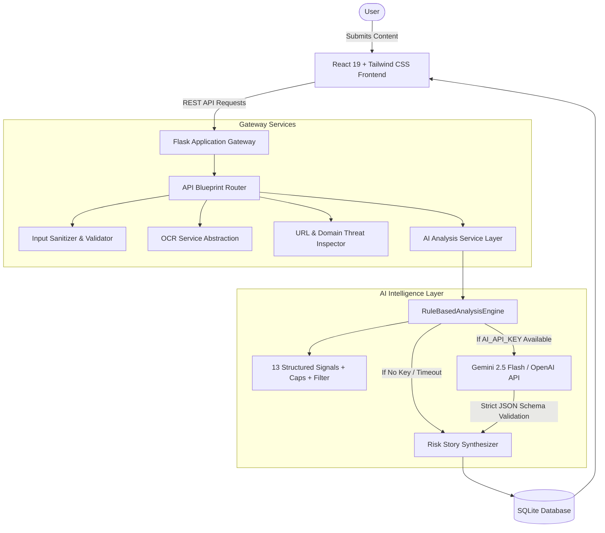

# SafeSpeak AI

> *"Think Before You Click."*

An AI-powered digital safety assistant engineered to protect everyday internet users from suspicious messages, phishing attempts, advance-fee scams, fraudulent internship/job offers, and deceptive URLs without complex cybersecurity jargon.

[](https://github.com)
[](LICENSE)
[](https://python.org)
[](https://react.dev)
[](https://tailwindcss.com)

---

## 1. Project Title
**SafeSpeak AI** — "Think Before You Click."

## 2. Problem Statement
**Hackathon Track:** *Digital Safety & Cybersecurity*

Every day, millions of students, job seekers, and digital consumers encounter sophisticated social-engineering attacks. Attackers no longer rely solely on malicious file attachments; instead, they exploit psychological human vulnerabilities—fear of account deactivation, excitement over lucrative internship offers, or urgency around unpaid bills. Ordinary users often lack the technical cybersecurity background to identify these warning signals before clicking or transferring money.

## 3. Problem Being Solved
Existing scam detection tools suffer from two major flaws:
1. **Generic AI Prompt Boxes:** Forcing users into unstructured chatbot interfaces that lack dedicated cybersecurity workflows and visual threat telemetry.
2. **Binary "Safe / Scam" Verdicts:** Simply labeling content as "Safe" or "Scam" fails to educate users, leaves them skeptical, and provides zero guidance on *why* the message is dangerous or what corrective actions to take.

## 4. The Solution
SafeSpeak AI provides an **explainable, structured digital defense platform** designed as a polished cybersecurity SaaS product:

$$\text{User Input} \longrightarrow \text{Analyze} \longrightarrow \text{Detect Warning Signals} \longrightarrow \text{Risk Assessment} \longrightarrow \text{Explain Simply} \longrightarrow \text{Recommend Action}$$

Rather than presenting mathematical certainty, SafeSpeak AI deconstructs the attack through its signature **Risk Story** engine, breaking the deception into understandable psychological stages (Trigger $\rightarrow$ Pressure $\rightarrow$ Request $\rightarrow$ Potential Risk) and delivering tailored safety checklists.

---

## 5. Key Features

### ✉️ 1. Message Scanner
- Deep inspection for SMS, WhatsApp chats, emails, and job/internship proposals.
- Detects 13 standardized structured threat indicators: `URGENCY`, `PAYMENT_REQUEST`, `JOB_OR_INTERNSHIP_FEE`, `OTP_REQUEST`, `CREDENTIAL_REQUEST`, `PERSONAL_INFORMATION_REQUEST`, `REWARD_OR_PRIZE`, `UNREALISTIC_PROMISE`, `ACCOUNT_SUSPENSION`, `THREAT_LANGUAGE`, `IMPERSONATION`, `SUSPICIOUS_URL`, `CALL_TO_ACTION`.
- Multilingual analysis support: Full UTF-8 Unicode matching for English and Tamil scam scripts (e.g., பணம் செலுத்துங்கள், உடனடியாக, வேலை வாய்ப்பு, கடவுச்சொல்).
- Anti-false-positive filtering: Contextual brand detection prevents benign references (e.g., "Google Meet") from triggering impersonation flags unless accompanied by coercion or financial demands.
- Category score caps: Artificial urgency signals are capped at 25 points to prevent repetitive keywords from inflating risk scores artificially.

### 📸 2. Screenshot Scanner (OCR)
- Upload screenshots of suspicious WhatsApp chats, SMS notifications, or emails.
- Text is extracted via OCR and presented in an editable review window so users can inspect and refine the extracted wording before launching the AI analysis.

### 🌐 3. URL Safety Checker
- Evaluates domain structural anomalies, unencrypted HTTP protocols, IP-based URLs, URL shortener masks, Punycode/homoglyph brand spoofing, excessive subdomains, and high-risk top-level domains (`.xyz`, `.top`, `.click`, `.buzz`).
- Analyzes URLs using 12 structured signal categories with calibrated severity and transparent score contribution.
- Uses conservative, responsible phrasing (*"Potential warning signs detected based on domain and URL structural heuristics"*) without unsubstantiated WHOIS claims.

### 🚩 4. AI Risk Assessment, Calibrated Score & Confidence Rating
- Clear Risk Levels: **LOW RISK** (0–34), **MEDIUM RISK** (35–69), and **HIGH RISK** (70–100).
- Transparent **Confidence Rating** (**High**, **Medium**, **Low**) reflecting evidence depth, input length, and corroborating signals.
- Intuitive visual radial gauge paired with dynamic confidence badge and probabilistic advisory disclaimer.

### 💡 5. "Explain Simply" (Zero-Jargon)
- Plain-English breakdown explaining the scam mechanism in everyday language without intimidating technical jargon.

### 🌟 6. Signature Feature: The Risk Story
**"How the Message Is Trying to Influence You"** breaks the attack down into four intuitive steps:
1. **TRIGGER:** The initial bait or lure (*e.g., "You have been selected for an exclusive internship"*).
2. **PRESSURE:** The artificial urgency (*e.g., "Pay within 30 minutes to confirm your position"*).
3. **REQUEST:** The demanded action (*e.g., "Pay ₹999 registration fee via external link"*).
4. **POTENTIAL RISK:** The real-world consequence (*e.g., "Direct financial loss plus payment credential compromise"*).

### 🛡️ 7. Dynamic Safety Actions Checklist & Incident Export
- Interactive checklist with tailor-made protective steps based on the detected threats.
- One-click **"Copy Incident Report"** button to facilitate formal reporting to authorities or college placement cells.
- Prominent in-app **Privacy Notice** reminding users never to submit live passwords, OTPs, or financial secrets.

### 📊 8. Telemetry Dashboard
- Metrics tracking Total Scans, High-Risk Detections, Medium-Risk Detections, and Low-Risk Detections.
- Visual risk distribution bar and recent scan activity stream with engine tracking (`rule-based` vs `hybrid`).

### 🗄️ 9. Analysis History & Audit Logs
- Persistent SQLite storage with keyword search, risk-level filters, and content-type filters.
- Tracks `confidence` and `engine` alongside structured signals, Risk Story, and recommendations.
- Re-inspect any previous scan with full telemetry or clear history with a single click.

### 📚 10. Educational Safety Center
- 8 beginner-friendly guides:
  1. *How Phishing Works*
  2. *Identifying Fake Job & Internship Offers*
  3. *OTP & 2FA Security*
  4. *Password Hygiene & Credential Theft*
  5. *Suspicious Links & Typosquatting*
  6. *Social Engineering & Urgency Traps*
  7. *Fake Customer Support & Search Scams*
  8. *Online Payment & QR Code Fraud*
- Interactive **"Spot the Red Flag"** mini-quiz for interactive reflex training.
- Emergency direct helpline directory (India: 1930 / USA: ReportFraud.ftc.gov / Global: IC3).

### 📝 11. Guided Cybercrime Complaint-Assistance System
- Direct bridge from any scan evaluation: When high or medium risk is detected, a 1-click **"Prepare a Cybercrime Complaint"** card immediately pre-populates a structured incident reporting workflow.
- 4-Step Interactive Wizard:
  1. **Incident Category:** Financial Fraud / UPI Scam, Phishing / Identity Theft, Fake Job / Internship Scam, Social Media Impersonation, Cyber Harassment / Extortion, Malicious Website / Malware.
  2. **Incident Details & Financial Loss:** Captured incident date, suspect contact (phone, handle, URL), description narrative, and conditional financial details (Amount, Transaction ID/UTR, Bank/Payment App, Account Number). If financial loss is indicated, displays high-priority guidance to dial **1930** immediately.
  3. **Evidence Preservation Checklist:** Actionable reminders to capture full uncropped screenshots, export chat history (.txt), download bank statements, save transaction SMS, and freeze compromised cards/UPI IDs.
  4. **Structured Complaint Draft:** Real-time generation of an objective, factual, chronological complaint ready for formal submission. Features 1-click **Copy to Clipboard**, **Download TXT**, **Print / Save as PDF**, and direct access button to the **Official Indian Cybercrime Portal** (`https://cybercrime.gov.in/`).
- Anti-credential protection: Proactively checks against live password/OTP entry and displays privacy warnings.

### ✨ 12. Resilient Demo Mode with Dynamic Real Engine Analysis
- Functions out-of-the-box with 0 external API dependencies.
- 5 realistic predefined samples (Fake internship scam, Bank KYC alert, Lottery prize, Suspicious login, and Legitimate work meeting).
- Evaluated on-the-fly through the real risk engine rather than returning arbitrary static hardcoded scores.
- Clearly labeled **"Demo Mode — simulated analysis"** badge.

---

## 6. How AI is Used
SafeSpeak AI employs a **Hybrid Intelligence Architecture**:
1. **Deterministic Heuristic Threat Engine:** A local rules engine that inspects regex token patterns, linguistic coercion markers, currency symbols, and domain topologies. Always establishes a deterministic baseline.
2. **LLM Provider Integration:** If `AI_API_KEY` is present (Gemini 2.5 Flash / OpenAI GPT-4o-mini), the service enriches the explanation and risk story while strictly retaining verified heuristic signals.
3. **Graceful Degradation:** If the external AI API key is omitted, unreachable, or times out, the local heuristic engine takes over seamlessly with identical structured outputs and zero system downtime.

---

## 7. System Architecture



For full architectural blueprints, see [ARCHITECTURE.md](ARCHITECTURE.md).

---

## 8. Tech Stack

| Tier | Technologies |
|---|---|
| **Frontend** | React 19, Vite 8, Tailwind CSS v4, Lucide React Icons |
| **Backend** | Python 3.13, Flask 3.1, Flask-CORS, Pillow 12, Python-dotenv |
| **Database** | SQLite 3 (Indexed, ACID-compliant, Auto-migrated schema) |
| **AI Layer** | Hybrid Architecture (Gemini / OpenAI API + Deterministic Heuristic Engine) |
| **OCR Layer** | Service Abstraction (Tesseract check + Pillow format validation + Preset fallback) |
| **Testing** | Pytest 9.1 (29 automated test suites: unit, edge cases, Unicode/Tamil, complaints) |
| **IDE Tooling** | IntelliJ IDEA (Shared `.run` configurations, compound full-stack, step-by-step guide) |

---

## 9. Project Structure

```
safespeak-ai/
├── .run/                                # IntelliJ IDEA Shared Run Configurations
│   ├── Backend (Flask).run.xml          # Run/Debug Flask backend in IntelliJ
│   ├── Frontend (Vite).run.xml          # Run/Debug Vite frontend in IntelliJ
│   └── SafeSpeak AI (Full Stack).run.xml # Single-click Compound Run Configuration
│
├── frontend/
│   ├── src/
│   │   ├── components/
│   │   │   ├── Navbar.jsx               # Cyber branding, 9 responsive routes & Scan Now CTA
│   │   │   ├── Footer.jsx               # Helplines & responsible AI disclaimer
│   │   │   ├── RiskGauge.jsx            # Radial gauge + Confidence rating badge
│   │   │   ├── RiskStoryCard.jsx        # Signature 4-stage persuasion pipeline
│   │   │   ├── WarningSignalsList.jsx   # Structured red flags with score contributions
│   │   │   ├── ExplainSimply.jsx        # Plain-English non-technical summary
│   │   │   ├── SafetyActionsChecklist.jsx # Interactive defense checklist
│   │   │   ├── ScanResultView.jsx       # Consolidated view + Prepare Complaint bridge
│   │   │   └── DemoSelector.jsx         # 1-click dynamic predefined sample loader
│   │   ├── pages/
│   │   │   ├── LandingPage.jsx          # Hero, workflow, presets & interactive scenarios
│   │   │   ├── DashboardPage.jsx        # Metrics, threat charts & recent scans
│   │   │   ├── ScanPage.jsx             # Scanner with prominent Privacy Notice
│   │   │   ├── ReportCybercrimePage.jsx # 4-step Cybercrime Complaint-Assistance Wizard
│   │   │   ├── HistoryPage.jsx          # Searchable scan audit logs + file complaint
│   │   │   ├── SafetyCenterPage.jsx     # 8 educational guides & interactive quiz
│   │   │   └── AboutPage.jsx            # Architecture & privacy pledge
│   │   ├── services/
│   │   │   ├── api.js                   # REST API client with resilient fallbacks & error handling
│   │   │   └── complaintGenerator.js   # Client-side fallback complaint draft generator
│   │   ├── App.jsx                      # Root navigation & state container
│   │   ├── index.css                    # Tailwind CSS v4 cyber theme
│   │   └── main.jsx                     # Vite React entrypoint
│   ├── package.json
│   └── vite.config.js                   # Reverse proxy with connection error interception
│
├── backend/
│   ├── app/
│   │   ├── config/
│   │   │   └── config.py                # Environment configuration & limits
│   │   ├── models/
│   │   │   └── database.py              # SQLite schema, CRUD & stats aggregation
│   │   ├── routes/
│   │   │   └── api.py                   # REST endpoints for scan, OCR, complaints & history
│   │   ├── services/
│   │   │   ├── ai_service.py            # Structured signals, scoring, caps & hybrid engine
│   │   │   ├── complaint_service.py     # Cybercrime complaint validation & drafting
│   │   │   ├── ocr_service.py           # Image verification & text extraction
│   │   │   └── url_service.py           # Structured URL anatomy & heuristics
│   │   ├── utils/
│   │   │   └── validators.py            # Sanitizers & input validation
│   │   └── __init__.py                  # Flask application factory
│   ├── tests/
│   │   └── test_api.py                  # 29 automated unit, edge, complaint & integration tests
│   ├── requirements.txt
│   └── run.py                           # Backend server entrypoint
│
├── ARCHITECTURE.md                      # Detailed technical architecture specification
├── INTELLIJ_SETUP.md                    # Step-by-step IntelliJ IDEA setup guide
├── README.md                            # Comprehensive project documentation
├── .env.example                         # Environment configuration template
├── .gitignore                           # Git ignore rules
└── LICENSE                              # MIT License
```

---

## 10. Running in IntelliJ IDEA (Recommended)

SafeSpeak AI includes pre-configured **IntelliJ IDEA Shared Run Configurations** in the `.run/` directory.

### Quick Start in IntelliJ IDEA:
1. Open IntelliJ IDEA $\rightarrow$ **Open** $\rightarrow$ select the `safespeak-ai` directory.
2. When prompted, trust the project.
3. Configure the Python Interpreter:
   - Go to **File $\rightarrow$ Project Structure $\rightarrow$ SDKs** (or **Settings $\rightarrow$ Languages & Frameworks $\rightarrow$ Python Interpreter**).
   - Point to your Python 3.10+ interpreter (or virtual environment).
4. Run Configurations will automatically appear in the top-right toolbar:
   - Select **Backend (Flask)** $\rightarrow$ click **Run** (green triangle) or **Debug** (bug icon).
   - Select **Frontend (Vite)** $\rightarrow$ click **Run** (or open the built-in terminal and run `npm run dev` in `frontend/`).
5. Open your browser at:
   - Frontend: `http://localhost:3000`
   - Backend API: `http://127.0.0.1:5000/api/health`

For complete troubleshooting, plugin recommendations (Python, Node.js), and keyboard shortcuts, consult [INTELLIJ_SETUP.md](INTELLIJ_SETUP.md).

---

## 11. Command Line Setup Instructions

### Prerequisites
- **Python:** 3.10 or higher
- **Node.js:** 18 or higher (with `npm`)

### 1. Clone the Repository
```bash
git clone https://github.com/your-username/safespeak-ai.git
cd safespeak-ai
```

### 2. Backend Setup
```bash
cd backend

# Create virtual environment (optional but recommended)
python -m venv venv
# On Windows:
venv\Scripts\activate
# On Linux/macOS:
source venv/bin/activate

# Install dependencies
python -m pip install -r requirements.txt

# Run automated tests (29 tests)
python -m pytest tests/test_api.py -v

# Start the Flask Backend Server
python run.py
```
*Backend runs on `http://127.0.0.1:5000`.*

### 3. Frontend Setup
In a new terminal window:
```bash
cd safespeak-ai/frontend

# Install dependencies
npm install

# Build production bundle
npm run build

# Start Vite Development Server
npm run dev
```
*Frontend runs on `http://localhost:3000` (proxied to backend on port 5000).*

---

## 12. Production Deployment Guide (GitHub + Render)

SafeSpeak AI is engineered for separation of concerns and can be deployed with zero hassle to **Render** directly from your GitHub repository.

### Architecture

```
┌─────────────────────────────────┐           ┌─────────────────────────────────┐
│     Render Static Site          │  HTTPS    │     Render Web Service          │
│   (React 19 + Vite 8 SPA)       ├──────────►│ (Python 3.11 + Flask + Gunicorn)│
│  https://safespeak.onrender.com │   /api/   │   + Tesseract OCR in Docker     │
└─────────────────────────────────┘           └─────────────────────────────────┘
```

---

### Option A: 1-Click Automated Blueprint (`render.yaml`)

SafeSpeak AI includes a pre-configured `render.yaml` infrastructure-as-code blueprint:

1. **Push your repository to GitHub**:
   ```bash
   git add .
   git commit -m "chore: prepare for Render production deployment"
   git push origin main
   ```
2. Log into the [Render Dashboard](https://dashboard.render.com).
3. Click **New +** $\rightarrow$ **Blueprint**.
4. Connect your GitHub repository. Render reads `render.yaml` and automatically configures:
   - `safespeak-backend`: Web Service using Docker (`backend/Dockerfile`) with Tesseract OCR pre-installed and health check at `/api/health`.
   - `safespeak-frontend`: Static Site built with `npm run build` from `frontend/dist` with SPA rewrite rules (`/*` $\rightarrow$ `/index.html`).
5. Fill in the prompt values (or accept defaults):
   - Set `VITE_API_BASE_URL` in the frontend static site to your backend URL (e.g., `https://safespeak-backend.onrender.com`).
   - Set `FRONTEND_URL` in the backend service to your frontend static site URL (e.g., `https://safespeak-frontend.onrender.com`).
6. Click **Apply**.

---

### Option B: Manual Setup on Render

If you prefer setting up the services manually via the Render Dashboard:

#### 1. Deploy the Backend Web Service
1. In Render, click **New +** $\rightarrow$ **Web Service**.
2. Select your repository.
3. Configure the service settings:
   - **Name:** `safespeak-backend`
   - **Root Directory:** `backend`
   - **Runtime:** `Docker` (Render automatically detects `backend/Dockerfile`)
   - **Health Check Path:** `/api/health`
4. Add the following **Environment Variables**:
   | Variable | Value | Notes |
   | :--- | :--- | :--- |
   | `PORT` | `5000` | Port Gunicorn listens on |
   | `SECRET_KEY` | *(Click "Generate" or enter random string)* | Cryptographic security |
   | `FRONTEND_URL` | `https://safespeak-frontend.onrender.com` | Production CORS origin |
   | `AI_API_KEY` | *(Optional)* | Gemini / OpenAI API key |
   | `AI_PROVIDER` | `auto` | Auto-detects AI provider |
   | `AI_MODEL` | `gemini-2.5-flash` | LLM model name |
5. Click **Create Web Service**. Note the assigned URL (e.g., `https://safespeak-backend.onrender.com`).

#### 2. Deploy the Frontend Static Site
1. In Render, click **New +** $\rightarrow$ **Static Site**.
2. Select your repository.
3. Configure the static site settings:
   - **Name:** `safespeak-frontend`
   - **Root Directory:** `frontend`
   - **Build Command:** `npm install && npm run build`
   - **Publish Directory:** `dist`
4. Add the **Environment Variable**:
   | Variable | Value |
   | :--- | :--- |
   | `VITE_API_BASE_URL` | `https://safespeak-backend.onrender.com` |
5. In **Redirects / Rewrites**:
   - Add a Rewrite rule:
     - **Type:** `Rewrite`
     - **Source:** `/*`
     - **Destination:** `/index.html`
   *(This ensures client-side routing like `/features`, `/scan`, and `/report` works on direct page refreshes).*
6. Click **Create Static Site**.

---

### Production Notes & Persistence

- **OCR in Production:** Render Docker container installs `tesseract-ocr` and `tesseract-ocr-eng` system packages at build time, giving you real image text extraction without relying on platform-specific Windows APIs.
- **SQLite Database Persistence:** By default on Render's free tier, the local filesystem is ephemeral and resets on restarts. For permanent scan history persistence across deploys on paid tiers, mount a Render Disk to `/app/data`.
- **Health Check Endpoint:** The backend exposes `/api/health` which responds with `200 OK` and zero secret leakage.

---

## 13. Environment Variables

SafeSpeak AI works out-of-the-box **without** mandatory environment variables (utilizing its built-in rule engine). 

To customize or connect external LLM providers, copy `.env.example` to `.env`:

```env
# Flask Backend Settings
HOST=127.0.0.1
PORT=5000
SECRET_KEY=safespeak-ai-production-secret-key
FRONTEND_URL=https://safespeak-frontend.onrender.com

# Optional External AI API Key (Gemini or OpenAI)
AI_API_KEY=your_gemini_or_openai_api_key_here
AI_PROVIDER=auto
AI_MODEL=gemini-2.5-flash

# Maximum Upload File Size (Bytes)
MAX_CONTENT_LENGTH=10485760

# Frontend API URL (Set on Render Frontend Static Site)
VITE_API_BASE_URL=https://safespeak-backend.onrender.com
```

---

## 14. Demo Mode
SafeSpeak AI features a dedicated, transparent **Demo Mode**:
- Toggleable via the top navigation bar at any time.
- Features 5 realistic test cases covering internship scams, banking KYC fraud, lottery scams, unauthorized logins, and benign meeting invites.
- Every simulated analysis clearly indicates:  
  `Demo Mode — simulated analysis`

---

## 15. Screenshots & Visual Interface

### 1. Landing Page & Visual Workflow
*Hero banner with cybersecurity tagline ("Think Before You Click."), core 6-step analysis pipeline, and capability matrix.*

### 2. Security Overview Dashboard
*Real-time metrics (Total Scans, High Risk, Medium Risk, Low Risk), threat severity distribution bar, scans by surface, and recent analyses table.*

### 3. Scanner Hub (Message, Screenshot OCR & URL Checker)
*Tabbed scanner interface with character counters, preset sample buttons, screenshot drag-and-drop, and editable OCR review area.*

### 4. Signature Risk Story & Warning Signals Result
*Interactive radial threat gauge, detected red flag signals with quoted excerpts, 4-stage persuasion pipeline (Trigger $\rightarrow$ Pressure $\rightarrow$ Request $\rightarrow$ Potential Risk), Explain Simply card, and actionable safety checklist.*

### 5. Educational Safety Center & Interactive Quiz
*8 modular consumer protection guides, interactive "Spot the Red Flag" mini-quiz, and emergency helpline directory.*

---

## 16. Future Improvements
1. **Browser Extension:** Direct inline evaluation of links and webmail messages prior to navigation.
2. **Multi-lingual Translation:** Automatic language detection for regional scam lures (Hindi, Spanish, French, etc.).
3. **Automated Incident Forwarding:** Secure API integration to dispatch generated reports directly to National Cybercrime portals.
4. **QR Code Image Scanner:** Decoding embedded QR codes directly in the screenshot analyzer to detect fraudulent payment collect requests.

---

## 17. Responsible AI & Limitations

### Advisory Nature of Risk Scores
Risk scores are AI-assisted evaluations based on structural patterns and linguistic indicators. They must **never** be treated as mathematical or legal proof of fraud.

### Responsible Phrasing
In compliance with ethical cybersecurity guidelines, SafeSpeak AI avoids defamatory claims when analyzing external URLs, utilizing responsible phrasing such as:
> *"Potential warning signs detected based on domain and URL structural heuristics."*

### Zero-Retention Privacy Commitment
SafeSpeak AI **does not store** passwords, banking PINs, One-Time Passwords (OTPs), or government identification credentials. All analysis is performed ephemerally or in sanitized local databases.

---

## 18. License
This project is licensed under the [MIT License](LICENSE).

---

*Built with ❤️ for the Digital Safety & Cybersecurity Hackathon.*
